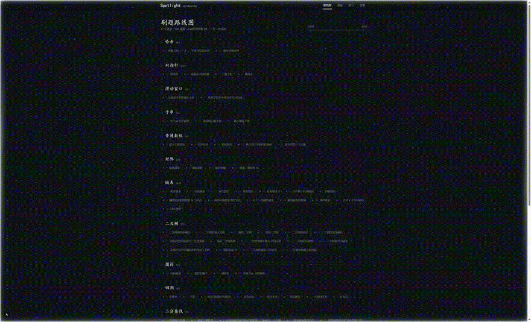

# AlgoStage · 算法讲台

> 像老师站在黑板前讲课一样学算法 —— AI 讲到哪，聚光灯打到哪。



AlgoStage 是一个**纯本地运行**的 LeetCode Hot 100 AI 学习系统：内置代码 playground、会讲课的 AI 导师（边讲边在页面上高亮当前位置、带华丽特效）、个人学习数据与看板。只需填入你自己的 **API Key + Model Name** 即可开始，无需任何服务器。

## 特性

- 🎯 **教鞭特效讲解**：AI 输出结构化讲解脚本，前端逐步播放 —— 聚光灯、粉笔划线、注意力涟漪、舞台压暗……讲到哪行代码，光就打在哪行
- 💻 **本地 Playground**：Monaco 编辑器 + 浏览器内执行（JS 沙箱 / Python Pyodide），离线可跑
- 🤖 **BYOK 内嵌 Agent**：填 API Key + model name 即用，基于 Vercel AI SDK，OpenAI / DeepSeek / Claude / Gemini 等几十家模型即插即用
- 📊 **个人看板**：刷题热力图、知识点掌握度、提示消耗、SM-2 间隔复习队列，全部存在本地 SQLite
- 🧩 **长期主义架构**：题目源、模型、特效、可视化器全部插件化，换数据源/换模型/加特效不动主框架
- 🔓 **开源合规**：不内置 LeetCode 题面原文，元数据 + 运行时客户端直取，见 [内容合规策略](docs/05-content-license.md)

## 快速开始

```bash
npm install
cp .env.example .env          # 可选：也可以启动后在设置页填 Key
npm run db:push && npm run db:seed   # 初始化本地 SQLite + 灌入 Hot 100
npm run dev                   # http://localhost:3000
```

首次打开进入设置页，填入 API Key 和模型名（如 `deepseek-chat`），即可让 AI 老师开课；不配置 Key 也能体验「两数之和」的内置旗舰讲解（含全部特效）。

> 环境说明：若项目目录在 sshfs 等限制 symlink 的挂载上，依赖安装需走「本地暂存 + 去引用同步」流程，见 [AGENTS.md](AGENTS.md)。

## 文档

| 文档 | 内容 |
|---|---|
| [docs/00-research.md](docs/00-research.md) | 竞品与开源项目调研（站在哪些巨人肩膀上） |
| [docs/01-architecture.md](docs/01-architecture.md) | 总体架构与插件化扩展点（骨架设计） |
| [docs/02-frontend-design.md](docs/02-frontend-design.md) | **前端设计文档（核心）**：视觉语言、动效系统、特效清单、页面设计 |
| [docs/03-teaching-protocol.md](docs/03-teaching-protocol.md) | 讲解脚本协议：AI 如何描述"讲什么、指哪里、放什么特效" |
| [docs/04-data-model.md](docs/04-data-model.md) | 数据模型与看板指标 |
| [docs/05-content-license.md](docs/05-content-license.md) | 开源内容合规策略 |
| [docs/06-judge-design.md](docs/06-judge-design.md) | 判题分层设计：JudgeBackend 插件点与四个后端（浏览器沙箱/本机编译器/Judge0/LeetCode 远程） |

## 技术栈

Next.js (App Router) · TypeScript · Tailwind CSS v4 · Motion (Framer Motion) · Monaco Editor · Vercel AI SDK · Prisma + SQLite · Zustand

## 致谢与参考

[krahets/hello-algo](https://github.com/krahets/hello-algo) · [algorithm-visualizer](https://github.com/algorithm-visualizer/algorithm-visualizer) (MIT) · [doocs/leetcode](https://github.com/doocs/leetcode) · [karanb192/algo-sensei](https://github.com/karanb192/algo-sensei) · [HugeCatLab/ChatTutor](https://github.com/HugeCatLab/ChatTutor) · [CopilotKit](https://github.com/CopilotKit/CopilotKit) · [LeetCode-OpenSource/vscode-leetcode](https://github.com/LeetCode-OpenSource/vscode-leetcode)

## License

MIT（代码）。题目内容来源与合规说明见 [docs/05-content-license.md](docs/05-content-license.md)。
